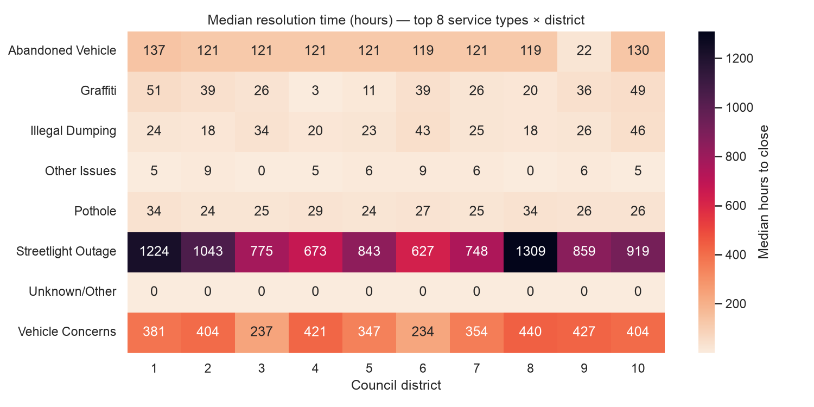
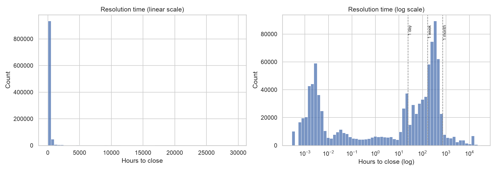

# San Jose 311 Service Request Analysis

**Where is San Jose slowest to resolve resident service requests, what
actually drives the delay, and where should the city reallocate resources?**

Framed as an analysis for the city manager's office: 1.1M+ 311 service
requests (2021–2024) cleaned, modeled into a star schema, queried with SQL
window functions, and tested statistically to separate real operational
bottlenecks from artifacts of raw request volume.

**Live dashboard:** _(publish via `tableau/BUILD_GUIDE.md`, then add the
Tableau Public link here)_

## Problem statement

San Jose's 311 system logs every non-emergency service request — potholes,
graffiti, abandoned vehicles, streetlight outages — across 39 departments
and 10 council districts. Raw request-volume dashboards answer "where do
the most complaints come from," which is mostly a population-density
question. The operationally useful question is different: **holding
category, season, and location constant, where is the city's response
actually slow, and is that slowness explained by something the city can
act on?**

## Data

- **[San Jose 311 Service Request Data](https://data.sanjoseca.gov/dataset/311-service-request-data)** — 2021–2024, ~1.12M rows, pulled programmatically via `src/download_data.py` (the portal issues signed, expiring S3 redirect URLs, not stable direct links, so a reproducible script has to resolve them at run time rather than hardcode a CSV URL).
- **[Council District boundaries](https://data.sanjoseca.gov)** (GeoJSON, with 2020 census population per district) — the supplementary dataset that turns a single flat 311 export into an actually-joinable schema and makes per-capita rates possible.

Both are public, no auth required. Full profiling and every cleaning
decision — including a mid-dataset CRM migration that silently changed the
channel taxonomy, and missing GPS coordinates encoded as `(0,0)` instead of
null — is documented in **[`docs/data_quality_log.md`](docs/data_quality_log.md)**.

## Methodology

| Stage | Tooling | What happens |
|---|---|---|
| Acquisition | Python (`src/download_data.py`) | Resolves the portal's redirect chain programmatically; pinned resource IDs for reproducibility |
| Cleaning | pandas / NumPy (`src/clean.py`) | Implements all 10 documented data-quality decisions; spatial join (Shapely STRtree) assigns each request to a council district |
| Storage | SQLite star schema (`sql/schema.sql`, `src/load_db.py`) | 1 fact table + 6 dimensions (status, service type, department, channel, district, date), FK-constrained |
| Analysis | SQL (`sql/analysis/*.sql`) | 10 queries — CTEs, window functions (`NTILE`, `RANK`, `LAG`), joins across every dimension |
| EDA | Matplotlib / Seaborn (`notebooks/01_eda.ipynb`) | Distribution, seasonal trend, district×category heatmap, channel comparison |
| Statistics | SciPy / statsmodels (`notebooks/02_statistical_analysis.ipynb`) | Mann-Whitney U test + OLS regression on log(resolution time) |
| Dashboard | Tableau Public (`tableau/`) | KPI cards, map, category drill-down, trend line — see `tableau/BUILD_GUIDE.md` |

**Engine note:** the database is SQLite rather than PostgreSQL. SQLite
(3.25+) fully supports CTEs and window functions, so nothing in the "real
SQL" requirement is lost, and anyone cloning this repo can run it with zero
server setup. Every query in `sql/analysis/` is standard ANSI SQL and runs
unmodified against Postgres if you point it at one.

## Key findings

**1. Streetlight Outage is the city's dominant bottleneck, and it isn't a district problem.**
Median resolution time for Streetlight Outage requests ranges from 627 to
1,309 hours *across every district* (see heatmap below) — the OLS
regression independently confirms this, showing Streetlight Outage takes
**~1,448% longer than the baseline category**, holding district and season
constant. A problem this uniform across geography points at the
category's process (dependent on external utility/contractor dispatch),
not local staffing.



**2. Weekend-submitted requests take ~219% longer to resolve, holding everything else constant.**
This survives controlling for category, district, channel, season, and
department workload — it isn't explained by "weekend requests happen to
be a harder category." It's a staffing-schedule effect: fewer people
triaging intake until the next business day.

**3. Raw request volume is a misleading guide for where to add resources — District 3's actual bottleneck ranking is much better than its raw volume suggests.**
District 3 (downtown) has the highest per-capita request rate of any
district. But once the regression controls for *what* is being requested
and *when*, District 3 resolves **~66% faster** than District 1, and
District 9 resolves **~64% faster** — District 1 and District 6/10 are the
real laggards. A dashboard built on raw volume alone would have pointed
resources at the wrong district.



**Supporting finding, flagged rather than oversold:** channel comparison
(Self-Service Digital vs. Staff-Assisted) shows a huge, statistically
significant gap (Mann-Whitney U, p ≈ 0, rank-biserial effect size = -0.771)
— but the likely explanation is that Staff-Assisted tickets are often
logged and closed in the same interaction (a staff member resolving
something on the spot), not that phone/walk-in service is inherently
faster. The actionable version of this finding is "audit why self-service
tickets sit in a dispatch queue," not "encourage residents to call instead
of using the app."

## Recommendations

1. **Audit or renegotiate the Streetlight Outage dispatch process** — this single category, uniformly slow citywide, is the highest-leverage fix available; it isn't a resourcing problem localized to any one district.
2. **Add weekend intake/triage staffing**, or at minimum a lighter-weight weekend acknowledgment process — the ~219% weekend penalty is a schedule gap, not a category-mix artifact.
3. **Reallocate district-level resources based on the regression ranking (District 1, 6, 10), not raw per-capita volume (which points at District 3)** — raw volume and actual bottleneck severity are not the same ranking here.
4. **Audit the self-service ticket dispatch queue** before drawing conclusions about channel efficiency — the gap is real, but its cause needs a operational look, not a policy nudge toward one channel.

## Limitations (stated explicitly, not hidden)

- Only ~43% of requests carry usable GPS coordinates (see data quality log #3); district-level and map-based findings cover that subset, not the full dataset.
- The 240-hour "target" used in `sql/analysis/07_pct_meeting_target_by_service_type.sql` is an illustrative benchmark, not an official city SLA — the dataset doesn't ship per-category response targets.
- The regression's R² (0.445) means ~55% of resolution-time variance is unexplained by the included predictors — there are real drivers (crew availability, weather, specific contractor terms) not captured in this dataset.

## Repo structure

```
data/            raw (gitignored) and processed data + SQLite DB
src/             download_data.py, clean.py, load_db.py, export_tableau_extract.py
sql/schema.sql   star schema DDL
sql/analysis/    10 analysis queries
notebooks/       01_eda.ipynb, 02_statistical_analysis.ipynb
tableau/         BUILD_GUIDE.md (dashboard build steps)
docs/            data_quality_log.md, saved figures
```

## Setup / reproduction

```bash
git clone <this-repo>
cd sj311-analytics
python3 -m venv .venv && source .venv/bin/activate
pip install -r requirements.txt

python3 src/download_data.py       # pulls 2021-2024 CSVs (~130MB total)
python3 src/clean.py               # writes data/processed/requests_clean.csv
python3 src/load_db.py             # builds data/processed/sj311.db (star schema)
python3 src/export_tableau_extract.py   # optional: for the Tableau dashboard

# run any analysis query, e.g.:
sqlite3 -header -column data/processed/sj311.db < sql/analysis/01_median_p90_by_service_type.sql

# open the notebooks
jupyter lab notebooks/
```
